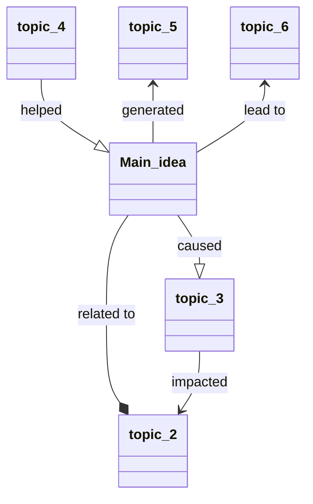

Related: [[Effective Note-Taking]], 

# Note-Taking Methods

## 1. The Outline method

Structure notes in form of an outline by using bullet points to represent different topics and their subtopics.

>Main topic 1N
>* Sub-topic 1
>	* Key fact or thought
>* Sub-topic 2
>	* Key fact or thought
> ...

Ideal when there is a relatively clear structure.

**Pros**

* Simplicity and ease of use
* Prioritize / highlight key ideas
* Reduce reviewing and editing time
* Proper and clean structure

**Cons**

* Not suitable for some topics
* Reviewing might be harder if bullet points are not detailed enough

## 2. The Cornell Method

The method organize notes into easily digestible summaries. This method is effective because the main points, details, study cues, and summary are all written in one place using a particular page layout.

| Placement  |      Width      | Notes                                     |
| ---------- |:---------------:| ----------------------------------------- |
| Left side  |  less than 1/3  | Cue/Recall column: Main ideas / Questions |
| Right side | remaining space | Notes Column: Main notes / Key thoughts   |
| Bottom     |        -        | Summary box: Summaries / Comprehension    |

Ideal for understanding key concepts.

**Pros**

* Notes are neatly organized, summarized, and easy to review 
* Extracts main ideas and concepts

**Cons**

* Requires some time for reviewing and summarising the key concepts

## 3: The Charting Method

Summarizing and comparing facts and statistics in a table format.

| Method   | Description | Ideal for | Pros | Cons |
| -------- | ----------- | --------- | ---- | ---- |
| Outline  |             |           |      |      |
| Cornell  |             |           |      |      |
| Charting |             |           |      |      |
| Mapping  |             |           |      |      |

Ideal for comparing, constrasting and memorizing alot of information.

**Pros**

* Information is clearly structured
* Great overview and facilitate reviewing

**Cons**

* Time-consuming method
* Requires information that are categorizable

## 4: The Mapping Method

Generate linked nodes from the main idea at the center outward to other concepts and establish relationships between the various ideas with arrows and symbols.

Ideal for visualising connected topics and ideas.

