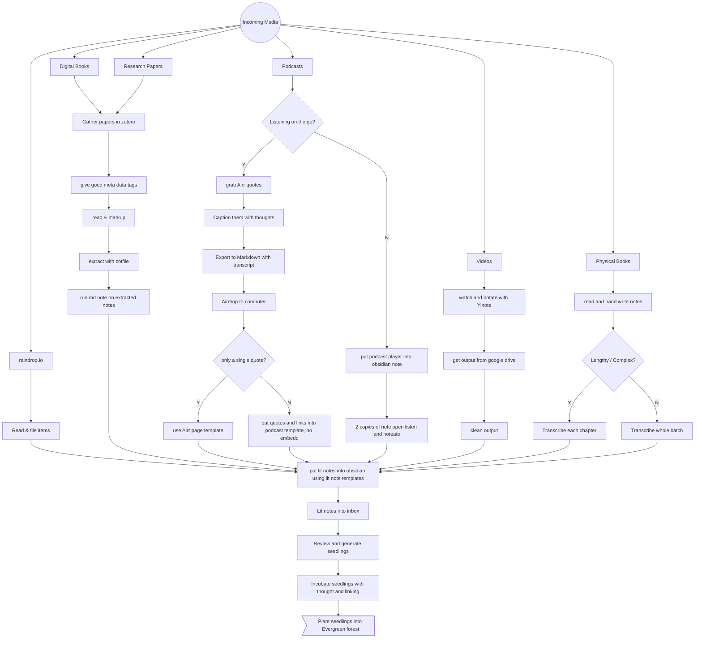

```mermaid
graph TD;
    A((Incoming Media))
    A-->B[raindrop.io]
    A-->C[Research Papers]
    A-->D[Podcasts]
    A-->E[Videos]
    A-->F[Digital Books]
    A-->G[Physical Books]
    F-->L1
    B-->M1[Read & file items]
    M1-->L6
    C-->L1[Gather papers in zotero]
    L1-->L2[give good meta data tags]
    L2-->L3[read & markup]
    L3-->L4[extract with zotfile]
    L4-->L5[run md note on extracted notes]
    L5-->L6[put lit notes into obsidian using lit note templates]
  D-->N0{Listening on the go?}
  N0--Y-->NN[grab Airr quotes]
  NN-->NN0[Caption them with thoughts]
  NN0-->NN1[Export to Markdown with transcript]
  NN1-->NN2[Airdrop to computer]
  NN2-->NN3{only a single quote?}
  NN3--Y-->NNN1[use Airr page template]
  NNN1-->L6
  NN3--N-->NNN2[put quotes and links into podcast template, no embedd]
  NNN2-->L6
    N0--N-->N1[put podcast player into obsidian note]
    N1-->N2[2 copies of note open listen and noteate]
    N2-->L6
    E-->O1[watch and notate with Yinote]
    O1-->O2[get output from google drive]
    O2-->O3[clean output]
    O3-->L6
    G-->P1[read and hand write notes]
    P1-->P2{Lengthy / Complex?}
    P2--Y-->Q1[Transcribe each chapter]
    Q1-->L6
    P2--N-->Q2[Transcribe whole batch]
    Q2-->L6
    L6-->L7[Lit notes into inbox]
    L7-->L8[Review and generate seedlings]
    L8-->L9[Incubate seedlings with thought and linking]
    L9-->L10>Plant seedlings into Evergreen forest]
```