Link: [Website](https://mermaid-js.github.io/mermaid/#/), [YouTube](https://www.youtube.com/watch?v=rXhUeV5Ko7g)
### Diagrams that mermaid can render
### [Flowchart](https://mermaid-js.github.io/mermaid/#/flowchart?id=flowcharts-basic-syntax)
TD = Top Down
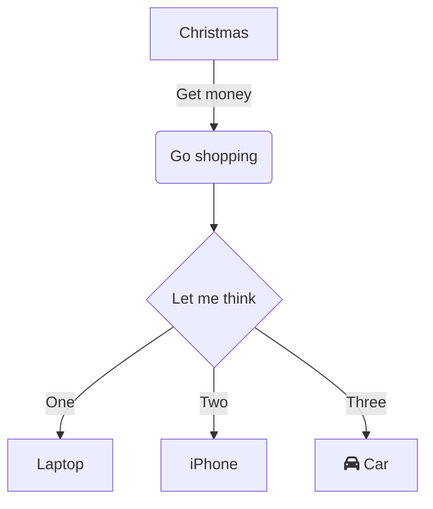

Direction
TB
BT
LR
RL

### [Sequence diagram](https://mermaid-js.github.io/mermaid/#/sequenceDiagram)

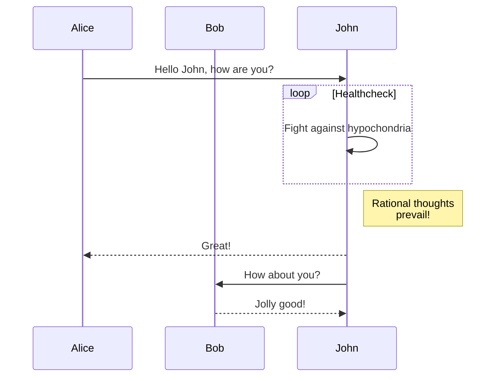

### [Gantt diagram](https://mermaid-js.github.io/mermaid/#/gantt)

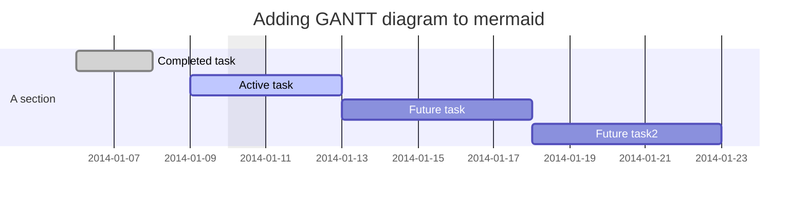

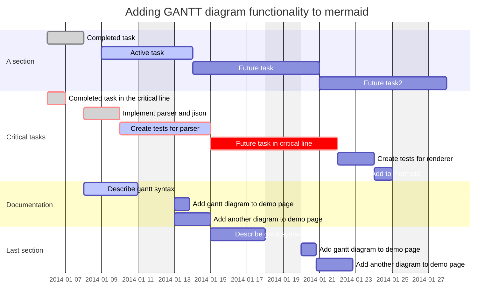

### [Class diagram](https://mermaid-js.github.io/mermaid/#/classDiagram)

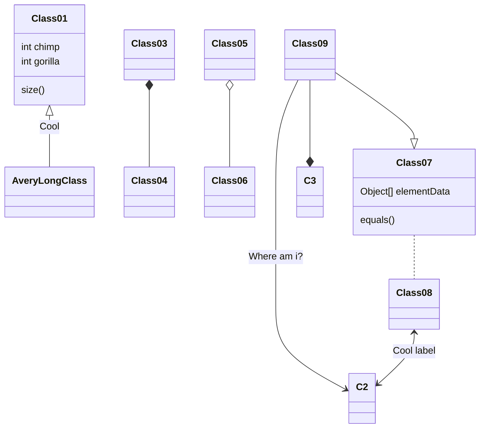

### [Git graph - ! experimental](https://mermaid-js.github.io/mermaid/#/?id=git-graph-exclamation-experimental)

### [Entity Relationship Diagram - !experimental](https://mermaid-js.github.io/mermaid/#/entityRelationshipDiagram)
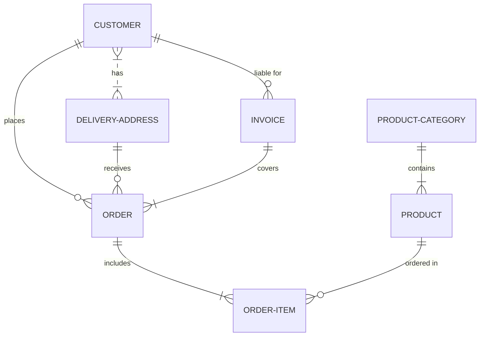

### [User Journey Diagram](https://mermaid-js.github.io/mermaid/#/user-journey)

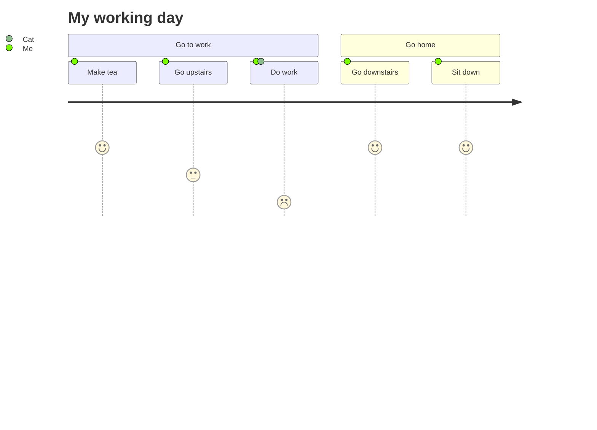

### Pie chart

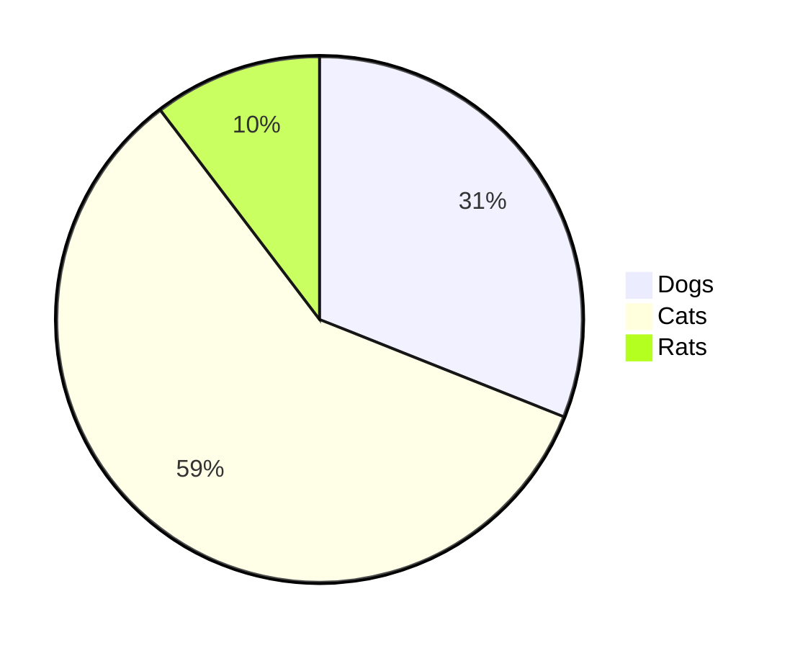

### classDiagram

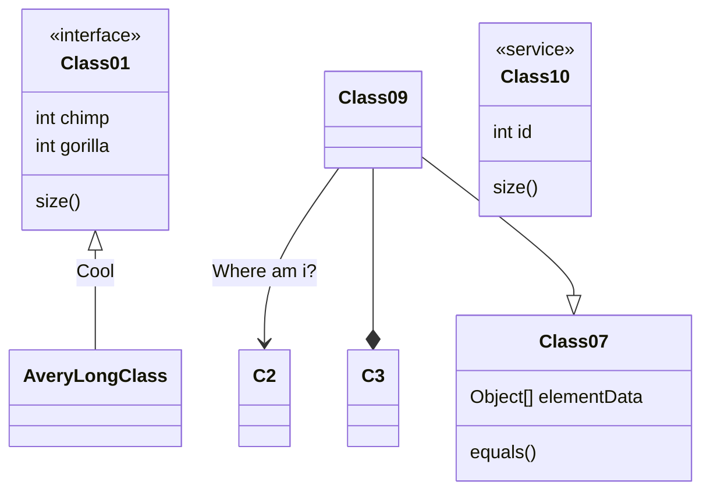

### stateDiagramv2

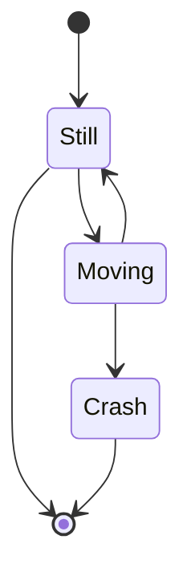

### Other examples

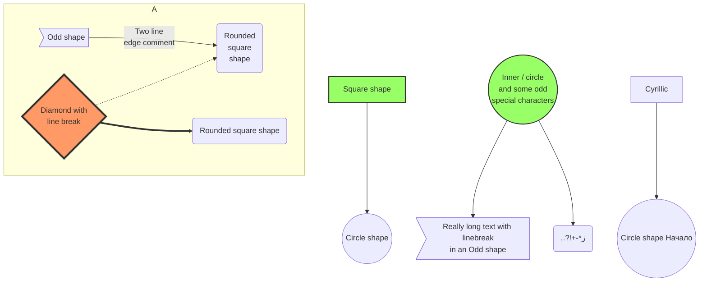

### Timeline

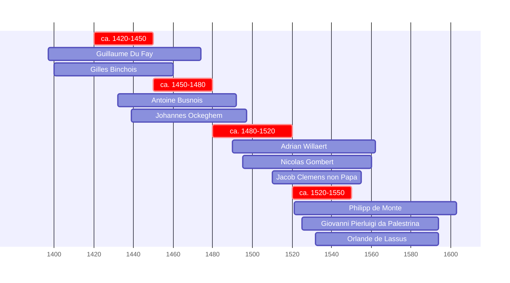

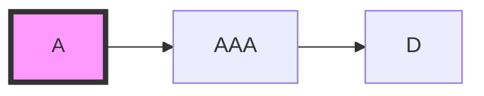

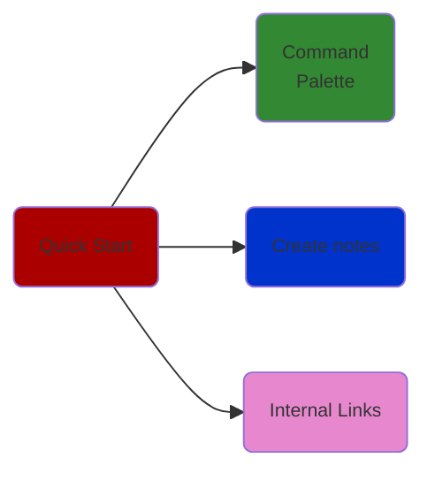

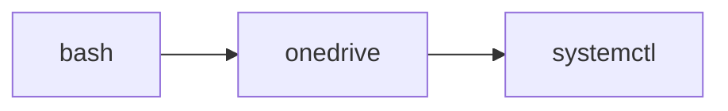

https://mermaid-js.github.io/mermaid/#/classDiagram?id=styling
https://github.com/mermaidjs/mermaid-gitbook/blob/master/content/flowchart.md#styling-a-node