Link: https://unpkg.com/mermaid@0.5.3/dist/www/all.html#flowcharts-basic-syntax

### Pie Charts
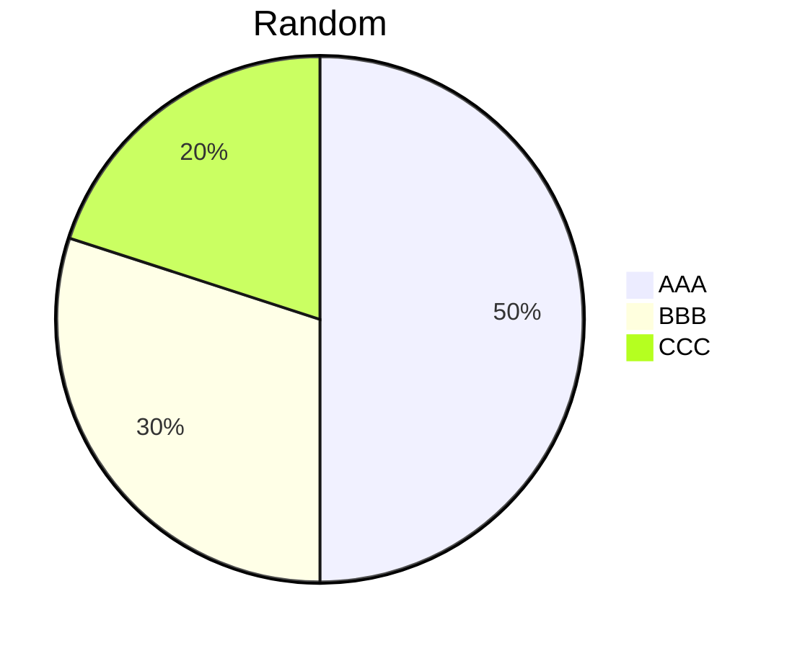
```mermaid
pie 
	title Random
	"AAA" : 50
	"BBB" : 30
	"CCC" : 20
```

### Graphs
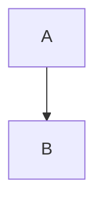
```mermaid
graph TD
A --> B
```

#### Direction
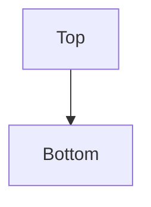
```mermaid
graph TB
	Top --> Bottom
```

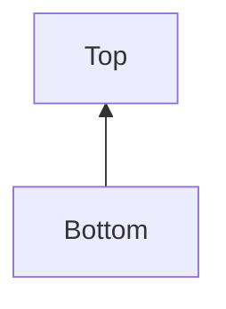
```mermaid
graph BT
	Bottom --> Top
```

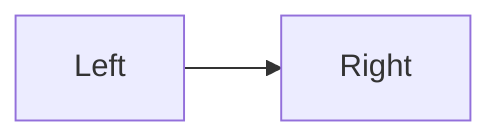
```mermaid
graph LR
	Left --> Right
```

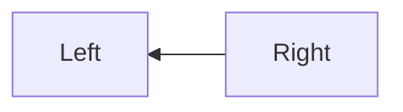
```mermaid
graph RL
	Right --> Left
```

### Shapes
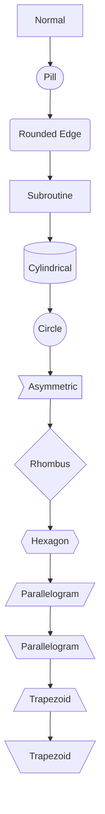
```mermaid
graph TD
	A[Normal] -->
	B([Pill]) -->
	C(Rounded Edge) -->
	D[Subroutine] -->
	E[(Cylindrical)] -->
	F((Circle)) -->
	G>Asymmetric] -->
	H{Rhombus} -->
	I{{Hexagon}} -->
	J[/Parallelogram/] -->
	K[\Parallelogram\] -->
	L[/Trapezoid\] -->
	M[\Trapezoid/]
```

### Link shape
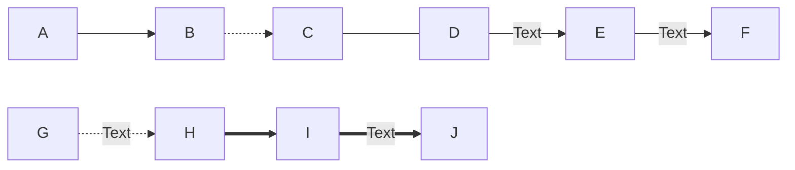
```mermaid
graph LR
	A --> B -.-> C --- D --Text--> E -->|Text| F
	G -.Text.-> H ==> I == Text ==> J
```

### Styling
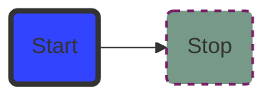
```mermaid
graph LR
    id1(Start)-->id2(Stop)
    style id1 fill:#34f,stroke:#333,stroke-width:4px;
    style id2 fill:#798,stroke:#726,stroke-width:2px,stroke-dasharray: 5, 5;
```

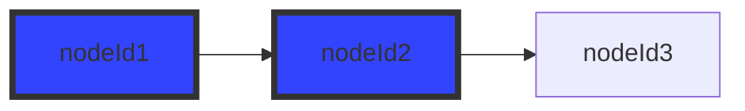
```mermaid
graph LR
    nodeId1 --> nodeId2 --> nodeId3
    classDef className fill:#34f,stroke:#333,stroke-width:4px;
	class nodeId1,nodeId2 className;
```

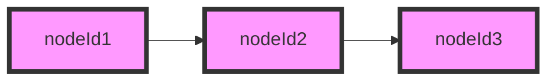
```mermaid
graph LR
    nodeId1 --> nodeId2 --> nodeId3
    classDef default fill:#f9f,stroke:#333,stroke-width:4px;
```

