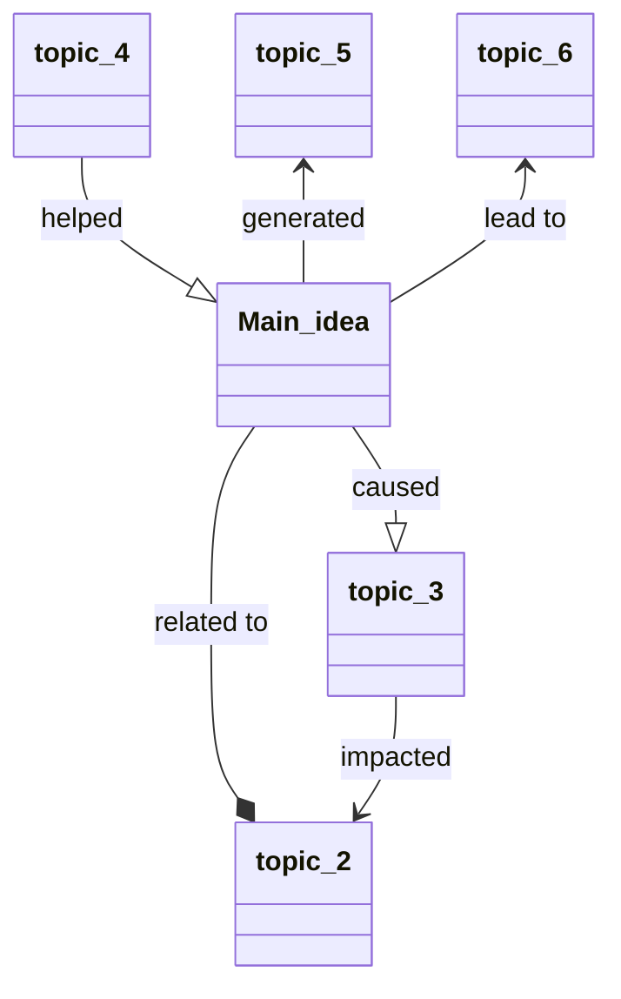

Related: [[Effective Note-Taking]], 

# Note-Taking Methods

## 1. The Outline method

Structure notes in form of an outline by using bullet points to represent different topics and their subtopics.

>Main topic 1N
>* Sub-topic 1
>	* Key fact or thought
>* Sub-topic 2
>	* Key fact or thought
> ...

Ideal for creating questions for review

**Pros**

* Simplicity and ease of use
* Outlining records content as well as relationships
* Reduce reviewing and editing time

**Cons**

* Not suitable for some topics that involves formulas or charts

## 2. The Cornell Method

The method organize notes into easily digestible summaries. This method is effective because the main points, details, study cues, and summary are all written in one place using a particular page layout.

| Placement  |      Width      | Notes                                     |
| ---------- |:---------------:| ----------------------------------------- |
| Left side  |  less than 1/3  | Cue/Recall column: Main ideas / Questions |
| Right side | remaining space | Notes Column: Main notes / Key thoughts   |
| Bottom     |        -        | Summary box: Summaries / Comprehension    |

Ideal for understanding key concepts.

**Pros**

* Organized and systematic for recording and reviewing notes
* Extracts main ideas and concepts

**Cons**

* Requires some time for reviewing and summarising the key concepts

## 3: The Charting Method

Summarizing and comparing facts and statistics in a table format.

| Method   | Description | Ideal for | Pros | Cons |
| -------- | ----------- | --------- | ---- | ---- |
| Outline  |             |           |      |      |
| Cornell  |             |           |      |      |
| Charting |             |           |      |      |
| Mapping  |             |           |      |      |

Ideal for comparing, constrasting and reviewing lots of facts.

**Pros**

* Information is clearly structured and easy to review
* Highlights key pieces of information for each topic

**Cons**

* Time-consuming method
* Requires information that are categorizable

## 4: The Mapping Method

Generate linked nodes or branches from the main idea at the center outward to other concepts and establish relationships between the various ideas with arrows and symbols.

Ideal for visualising connected topics and ideas.

**Pros**

* Useful for visual learners
* Helps you remember and connect relationships between topics.

**Cons**

*  
---

| Handwritten                                                             | Digital                                                              |
| ----------------------------------------------------------------------- | -------------------------------------------------------------------- |
| Easier to create diagrams and illustrations                             | Faster; easier to take higher volume of notes                        |
| Sometimes better for visual learners                                    | Easier to edit and reorganize for later studying                     |
| Provides more focus for students prone to digital distraction           | Can be backed up, shared, searched, etc.                             |
| Can be better for comprehension and retention of conceptual information | Can be better for comprehension and retention of factual information |